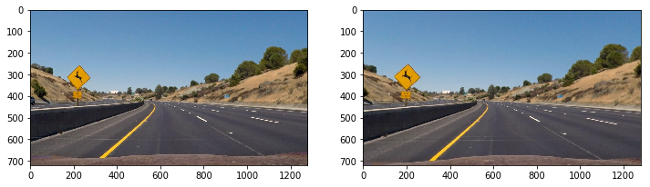

Advanced Lane finding using Computer Vision Techniques
---

The goals / steps of this project are the following:

* Compute the camera calibration matrix and distortion coefficients given a set of chessboard images.
* Apply a distortion correction to raw images.
* Use color transforms, gradients, etc., to create a thresholded binary image.
* Apply a perspective transform to rectify binary image ("birds-eye view").
* Detect lane pixels and fit to find the lane boundary.
* Determine the curvature of the lane and vehicle position with respect to center.
* Warp the detected lane boundaries back onto the original image.
* Output visual display of the lane boundaries and numerical estimation of lane curvature and vehicle position.

Camera Calibration
---
The images captured by camera are distorted. Camera matrix and distortion co-efficients specific to camera needs to be calculated in order to undistort the images. Given images of the chess board and openCV fuction called 'FindChessoboardCorners' is used to calculate the camera matrix and distortion co-efficient. Below is the given sample chess board image and the corresponding undistorted image.  

The camera matrix and distortion co-efficients are applied to road images. Below is the example input image and corresponding undistorted image.

Perspective Transform
---
The undistorted image is used to genertae bird's eye view of the image. Suitable source points and destination points are used to generate perspective matrix using openCV function called 'getPerspectiveTransform'. Below is the sample output of bird's eye view image.

Binary Image
---
The output of the bird's eye view image is used to generate binary image. I experimented different combinations of color threshold and gradient threshold to extract the lines in the binary image. Final output for one of the input image is shown below

Polyfitting the 2D curve on the binary image
---
Histogram for the lower part of the image is calculated to find left and right peak in the image. Those points are used as starting co-ordinates for the lane line. Mean of non zero points around the peaks are calculated and are then used to calculate the next center points in the window. Process is repeated till we reach top of the image. 
Using the non zero points 2D curve is drawn. Sample output image is shown below.

Curvature and position car from lanes
---
Curvature for both the lanes is calculated and shown on each image in the video. The distance of cars from the end lanes is calculated and is also shown on the image. Sanity check function is implemented to verify if lane curvature for left and right image doesnt vary much. The moving average for last N frames is used to store the left and right non zero points. Below is the output image showing lane marking.

Same procedure is used on the input video to generate the output video. Below is the output video with the lane marking.

